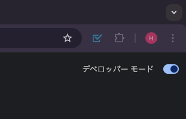
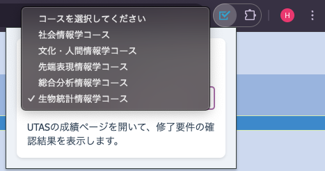
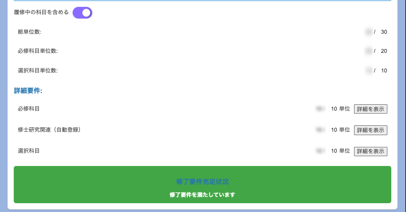

# 概要

このChrome拡張機能は、東京大学の学務システム (UTAS) の成績表示ページから、修了要件を満たすか否かを自動で確認できるツールです。  
想定利用者：学際情報学専攻 修士課程（ITASIAを除く）  
成績データを元に修了に必要な基準を満たしているかを簡単に確認できるため、履修状況の把握がスムーズになります。 
また、履修登録期間中にも利用でき、履修中の科目を含めた判定も可能なため、今後の履修計画を立てる際の参考にもなります。
## ご利用までの流れ
1. リポジトリをローカルにクローンまたはダウンロード
2. Chrome 拡張機能管理ページを開き、デベロッパーモードを有効にする

    

3.「パッケージ化されていない拡張機能を読み込む」を押下し、クローンまたはダウンロードしたフォルダ（manifest.json のあるフォルダ）を選択

    

4. ブックマークバーよりこの拡張機能をクリックし、ご自身のコースを選択

    

5. UTASの成績表示ページにアクセスすると、結果を確認できます。

    

<em>※プライバシー保護のため、スクリーンショットには一部モザイク処理を施しています。</em>

## 最後に
このChrome拡張機能は、学際情報学専攻 修士課程（ITASIAを除く）を対象とした利用を想定しています。他学部や他研究科での利用は想定しておらず、動作を保証するものではありませんので、あらかじめご了承ください。

ただし、本拡張機能はオープンソースとして公開していますので、ぜひフォークしてご自身で編集し、より使いやすいものに改良してください。皆さんのフィードバックや貢献をお待ちしています！

## 参考
- UTOL のトップページに「課題・テスト一覧」を表示させるやつ, https://github.com/so298/improved_utol
- 令和6年度 学際情報学府科目表, https://www.u-tokyo.ac.jp/content/400113836.pdf

# 免責事項 / Disclaimer

このChrome拡張機能は、個人の学習支援を目的として作成されたものであり、東京大学またはその他の公式機関とは一切関係がありません。本拡張機能の利用によって生じた損害や不利益について、作者は一切の責任を負いません。自己責任にてご利用ください。

This Chrome extension is developed for personal use and educational purposes, and it is not affiliated with the University of Tokyo or any official institution. The creator is not responsible for any damages or losses that may arise from using this extension. Please use it at your own risk.